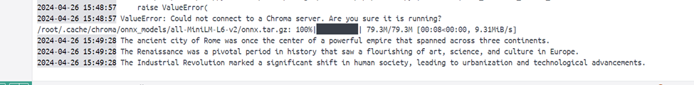

## chromadb_client

To check the chroma db:
1. http://localhost:8000/api/v1/ => contains heartbeat

Total 3 files:
1.  The Docker file containes the code to run either the app.py or the chroma_client.py
2. the chroma_client.py file contains the code to establish a connection to the chromadb docker, train the documents, save the trainings using   collections, save it and retrive it.
3. app.py file contains only the querying part
4. docker-compose file contains the code to join both the "above python file container" and the "chromadb container".

chromadb_client.py 

app.py output

Commands git in use:
1. git remote add origin https://github.com/saiadityavzure/chromadb_client.git
2. git branch -M main
3. git push -u origin main
4. git branch <new-branch> <base-branch>
5. git checkout -b <branch>
